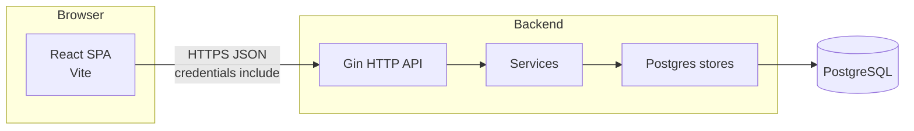

# Architecture

Parbin is a small full-stack app for listing meetup-style **events**, accepting public **suggestions**, and providing **admin** authentication and moderation. The repository is a **monorepo** with a React SPA and a Go API sharing no runtime code; they communicate over **JSON HTTP** with **cookie-based** admin sessions.

## High-level diagram



## Repository layout

```
parbin/
├── package.json          # Root scripts: dev:all, db:up, prepare:*
├── pnpm-lock.yaml
├── README.md
├── CONTRIBUTING.md
├── LICENSE
├── frontend/             # Vite + React + TypeScript
│   ├── package.json
│   ├── vite.config.ts
│   ├── components.json   # shadcn/ui config
│   └── src/
│       ├── App.tsx       # RouterProvider entry
│       ├── main.tsx
│       ├── router.tsx    # TanStack Router tree
│       ├── main-page.tsx # App shell (header, outlet, footer)
│       ├── index.css     # Tailwind + design tokens
│       ├── components/   # Feature + ui/ (shadcn)
│       ├── pages/        # Route-level screens
│       ├── hooks/        # e.g. use-event-manager
│       ├── lib/          # api.ts, utils, calendar helpers
│       └── types/        # Shared TS types (events, admin)
├── jobs/
│   └── event-scraper/    # TypeScript + Playwright; POST suggestions + dedupe via API
└── backend/              # Go module: parbin/backend
    ├── cmd/api/main.go   # Process entry: env, DB, migrations, HTTP server
    ├── docker-compose.yml # Local Postgres
    └── internal/
        ├── config/       # Env → Config
        ├── database/     # Migrations runner + SQL files
        ├── httpapi/      # Gin router, handlers, DTOs
        ├── service/      # AuthService, EventService, domain errors
        ├── store/        # pgx pool, CRUD for admins, sessions, events, suggestions
        └── auth/         # Password hashing, session token helpers
```

## Backend modules

| Package | Role |
| ------- | ---- |
| `cmd/api` | Loads `.env`, opens Postgres, runs migrations, wires stores and services, starts `http.Server` with Gin. |
| `internal/config` | Required: `DATABASE_URL`, `SESSION_SECRET`. Optional: `PORT`, `APP_TIMEZONE`, `FRONTEND_ORIGIN`, session and seed admin settings. |
| `internal/database` | Applies SQL migrations from `internal/database/migrations/` on startup. |
| `internal/httpapi` | Defines routes under `/api`, CORS for `FRONTEND_ORIGIN`, JSON request/response types, maps service errors to HTTP status. |
| `internal/service` | Business logic: login/logout, event CRUD, suggestion workflow, timezone-aware “today” for feeds. |
| `internal/store` | PostgreSQL access via `pgx` pool; models in `models.go`; `ErrNotFound`, `ErrConflict` for HTTP mapping. |
| `internal/auth` | Password verification and session token handling used by `AuthService`. |

## Frontend modules

| Area | Role |
| ---- | ---- |
| `router.tsx` | Declares routes: `/`, `events/$eventId`, `suggest`, `admin`, `past-events`; root component is `AppShell`. |
| `main-page.tsx` | Layout shell: decorative background layers, `AppHeader`, `Outlet`, `AppFooter`, global banners. |
| `hooks/use-event-manager.ts` | Central client state: admin session, events, mutations, talks to `lib/api.ts`. |
| `lib/api.ts` | `fetch` wrapper with `credentials: "include"`, base URL `VITE_API_URL`, typed API functions. |
| `components/ui/*` | shadcn/Radix primitives (buttons, dialogs, etc.). |
| `pages/*` | Screen-level composition for each route. |

## Data model (PostgreSQL)

Defined in `backend/internal/database/migrations/001_init.sql`:

- **admins** — email + password hash.
- **sessions** — hashed tokens, expiry, FK to admin.
- **events** — published events (`starts_at`, `ends_at`, tags, image URL, optional `source_event_page`, etc.).
- **event_suggestions** — public proposals with `pending` / `approved` / `rejected`, optional `source_event_id`, optional `source_event_page`, reviewer metadata.

## Cross-cutting concerns

- **Timezones**: Backend loads `APP_TIMEZONE` (default `America/Panama`) and uses it for “upcoming vs past” day boundaries and for formatting API `date` / `endDate` strings.
- **CORS + cookies**: API allows the configured frontend origin, methods GET/POST/PUT, `AllowCredentials: true`. Admin routes rely on an HTTP-only session cookie.
- **Local database**: `pnpm db:up` starts Postgres via `backend/docker-compose.yml`.

## Request path (example)

1. Browser calls `GET /api/events` (no auth).
2. `httpapi` → `EventService.ListEvents` → `EventStore` SQL.
3. Rows mapped to JSON `event` objects with local datetime strings.

For endpoint details, see [API](./api.md).
